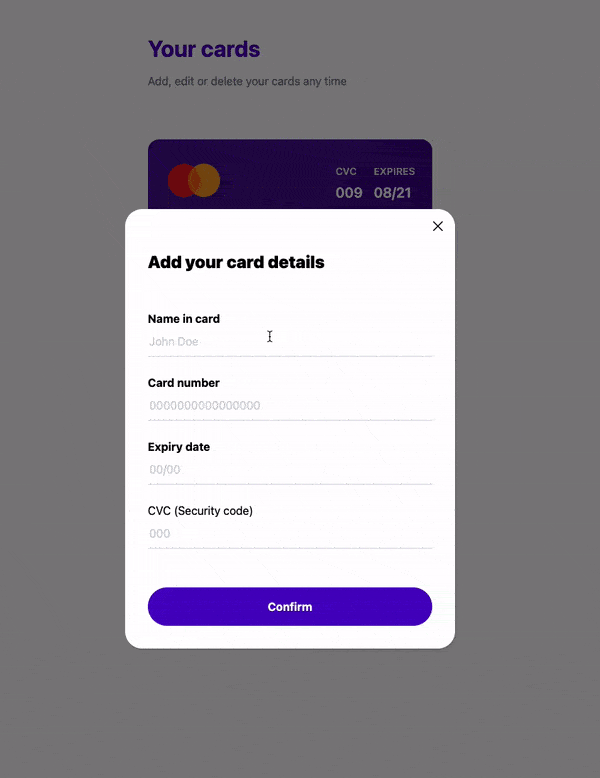

This is a simple Angular 17 app done as an interview assignment.    
It contains the following Angular concepts:  
    - Angular components  
    - Scss styling  
    - Angular services  
    - angular-in-memory-web-api as a self-contained database on front-end side  
    - Http requests  
    - Observables  
    - Pipes (covered with unit tests)  
    - Models for the entities  
    - Enum for the types  
    - Angular reactive forms and form validation  
    - Assets  
    - Custom font  
    - Tailwind for styling of some parts of the app.  
 
In the app we have the functionalities to view our credit cards, to add a new card, to delete a card or edit a card.
Feel free to give it a try and experiment with it.  
 
Here is a demo of the app:  

 
 
To get the project running locally please do the following:
1. Clone the project
2. Run: `npm install`
3. run `ng serve`
4. Open your browser on port `4200`
5. That's it, you should have the project running!
